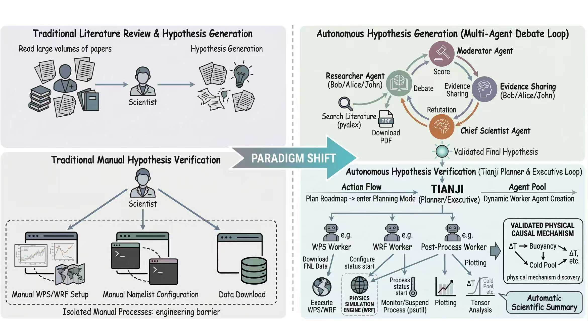

# TianJi: Autonomous AI Meteorologist —— An Intelligent System for Discovering Physical Mechanisms in Atmospheric Science
**The world's first AI meteorologist system capable of autonomously driving the WRF numerical model and verifying scientific hypotheses of atmospheric physical mechanisms**

## Project Overview
TianJi (Heavenly Secret) is a multi-agent driven scientific research system for atmospheric science jointly developed by **Nanjing University of Information Science & Technology (NUIST)**, **State Key Laboratory of Climate System Prediction and Risk Management**, and **China University of Petroleum (East China)**.
Based on large language models and the AgentScope framework, the system achieves full-process autonomous control of the WRF mesoscale numerical model by AI for the first time, completing an end-to-end scientific research closed loop from **literature research → scientific hypothesis generation → numerical experiment design → model operation → result analysis → mechanism verification**. It fills the technical gap in the field of AI meteorology from "data prediction" to "physical mechanism exploration".

This repository contains the test results, core architecture explanations, experimental data and visualization achievements of the TianJi system. The relevant research results were officially released in March 2026.

## Core Innovations
1. **Innovation in Scientific Research Paradigm**
Breaking through the limitation that traditional AI meteorological models can only perform statistical prediction, it realizes the transformation from a "black-box predictor" to an "interpretable research collaborator", providing a new paradigm for high-throughput exploration of atmospheric physical mechanisms.

2. **Dual-Module Intelligent Architecture**
- **Hypothesis Generation Module**: Based on a multi-agent debate mechanism in the style of academic seminars, combined with literature retrieval, it automatically generates scientific, innovative and non-hallucinatory scientific hypotheses.
- **Hypothesis Verification Module**: Autonomously drives the WRF numerical model, supports simple/complex dual execution modes, and completes the full process of data processing, parameter configuration, simulation operation, and multi-dimensional analysis.

3. **Breakthrough in Engineering Capabilities**
It has runtime fault self-healing capabilities, which can automatically correct errors in model configuration, data dimensions, process scheduling, etc.; it compresses the traditional scientific research cycle of several days to several hours.

4. **Professional Tool Bus**
Customizes four special tool sets for the meteorological field: physical simulation, spatiotemporal tensor calculation, visualization, and basic tools, adapted to WRF model and NetCDF data processing.

## System Architecture
The TianJi system adopts a multi-agent architecture with **decoupling of cognitive planning and engineering execution**, and is core divided into two major modules:
- **Hypothesis Generation**: Researcher Agent + Host Agent + Chief Scientist Agent, optimizing hypotheses through multiple rounds of debate and iteration.
- **Hypothesis Verification**: The Meta-Planner coordinates tasks, and professional work agents complete subtasks such as WPS/WRF preprocessing, simulation execution, post-processing, and trajectory analysis.

## Experimental Verification
The system has achieved expert-level experimental verification with **zero human intervention** in two classic atmospheric dynamic scenarios:

### 1. Regulatory Mechanism of Low Soil Moisture on Gust Fronts of Squall Line Cold Pools
Independently completed WRF simulation and analysis, verified the core hypothesis, and discovered a hidden physical signal that squall line convection moved southward by approximately 280 km, with the experiment taking about 55 minutes.

### 2. Nonlinear Impact of Sea Surface Temperature Anomalies on the Path of Typhoon In-Fa (2021)
Revised the human linear hypothesis, revealed the coupling mechanism of sea surface temperature-intensity-path, with the maximum southward deviation of the typhoon path by approximately 0.3387°, and the experiment taking about 130 minutes.

Meanwhile, it completed 4 basic scientific research analysis tasks including **typhoon pressure extraction, path plotting, precipitation analysis, and convergence field calculation**, and accurately output visual and quantitative results.

## Repository Description
- This repository is mainly used to store the test results, experimental data and visualization achievements of the TianJi system, and will continuously update the new experimental test results.
- The complete code of the system will be officially open-sourced to this repository later.

## Contact Information
- Corresponding Author: Fan Meng
- Email: meng@nuist.edu.cn
- Affiliation: School of Artificial Intelligence, Nanjing University of Information Science & Technology; State Key Laboratory of Climate System Prediction and Risk Management

## Acknowledgements
We would like to thank the support from the State Key Laboratory, Nanjing University of Information Science & Technology, China University of Petroleum (East China), as well as all team members who participated in the R&D and experimental verification.